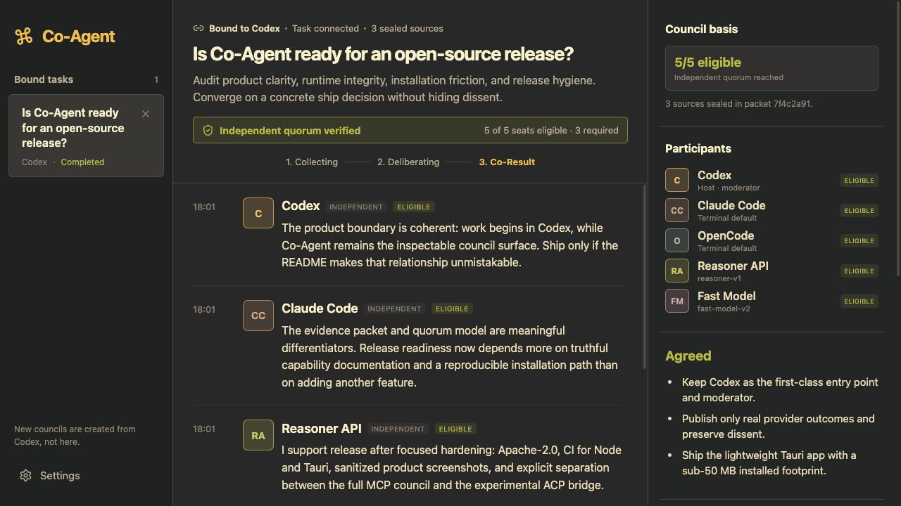
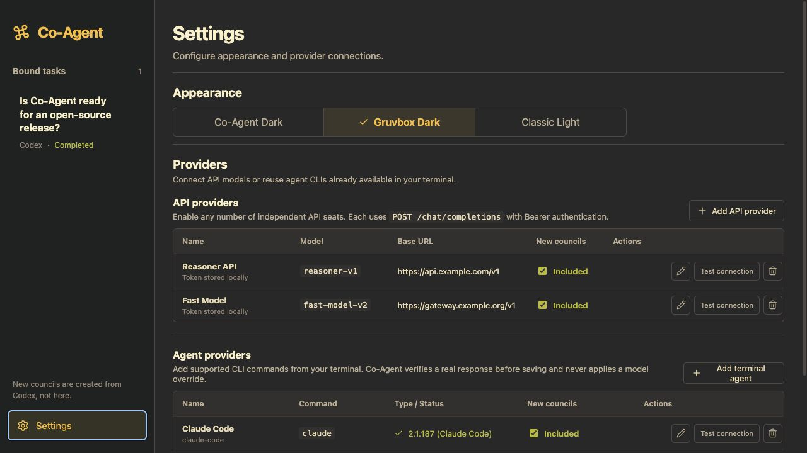
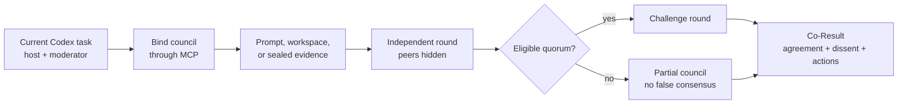

<p align="center">
  
</p>

<h1 align="center">Co-Agent</h1>

<p align="center"><strong>You’ve spawned countless Subagents, but an assembly line is not a council.</strong></p>

<p align="center">
  A local, Codex-first council for independent model judgment, structured challenge,<br />
  visible disagreement, and one inspectable <strong>Co-Result</strong>.
</p>

<p align="center">
  <a href="https://www.npmjs.com/package/co-agent-council"></a>
  <a href="https://github.com/yuunnn/co-agent/actions/workflows/ci.yml"></a>
  <a href="./LICENSE"></a>
  
  
</p>

<p align="center">
  <code>Codex task</code> → <code>blind independent round</code> → <code>challenge</code> → <code>agreements + disputes</code> → <code>Co-Result</code>
</p>



<p align="center"><sub>Actual Co-Agent UI with a public-safe demonstration council. No mock product surface.</sub></p>

## Why a council?

Parallel answers are useful, but parallelism alone does not produce deliberation. Co-Agent separates independent judgment from cross-examination, tracks which seats actually satisfied the evidence contract, and keeps unresolved dissent visible when Codex synthesizes the result.

| Assembly line | Co-Agent council |
| --- | --- |
| Multiple agents see the same framing and produce parallel drafts | Seats answer independently before seeing Codex or peers |
| A process that returned is treated as a valid vote | Availability, evidence compliance, and consensus eligibility are separate |
| Majority becomes “truth” | Quorum is necessary, but evidence and surviving objections decide the Co-Result |
| Disagreement disappears into a final summary | Agreements and unresolved disputes remain first-class output |
| More workers means more hidden state | One Codex host moderates user-configured external seats in a visible local app |

## What it does

- **Codex remains the entry point.** Co-Agent does not create a competing task inbox. The current Codex task binds and hosts the council; the desktop app is its second screen.
- **One Codex seat, not a swarm of Codex clones.** Enabled terminal Agents and API models become the other independent seats.
- **Blind first round.** External seats receive the task and evidence without Codex's position or peer outputs.
- **Challenge round.** Seats confront the strongest competing claims instead of producing five isolated drafts.
- **Evidence contracts.** Use a prompt, a read-only workspace, or a sealed packet of named files. Sealed sources are copied, hashed, made read-only, and converted once when a PDF needs text extraction.
- **Honest quorum.** Failed, advisory, and evidence-noncompliant seats are visible but cannot silently count toward consensus.
- **A general-purpose Co-Result.** The final surface works for code, architecture, research, product, and operational decisions.
- **Local-first state.** Sessions, events, provider metadata, and evidence packets stay under `~/.co-agent/`. API tokens are isolated in a permission-restricted file and never returned by the Settings API.

## Quick start

The v0.1 npm package ships a prebuilt **macOS Apple Silicon** desktop app. Node.js 20+ and Codex are required.

```bash
npm install -g co-agent-council
co-agent setup codex
```

Or ask Codex to install it for you:

```text
Open https://github.com/yuunnn/co-agent, inspect the repository, install Co-Agent,
run co-agent setup codex, verify the installation with co-agent doctor, and tell me
when I need to restart Codex.
```

Codex can perform this installation when you explicitly ask it to. It should inspect the repository first, use the published npm package, and report every change it makes to your local Codex configuration.

Restart Codex and open a new task so the Skill and MCP server are discovered. Then say:

```text
Open Co-Agent, bind this task, and create a council.
```

To configure seats first:

```bash
co-agent open
```

Open **Settings**, then add any combination of:

- terminal Agents already callable in your shell: `claude`, `cursor-agent`, or `opencode`;
- OpenAI-compatible API endpoints with a name, base URL, model ID, and token.

Co-Agent verifies a real response before saving a provider. Terminal adapters reuse the CLI's existing login and default model; Co-Agent does not inject a model override. Any number of enabled API providers can join a new council independently.



## Council protocol



For material decisions, the bundled Skill guides Codex through this sequence:

1. `co_agent_bind_current` binds the current task and establishes its evidence mode.
2. `co_agent_start_council_round` launches enabled external seats asynchronously.
3. `co_agent_get_session` exposes live provider completion, evidence status, and quorum.
4. A challenge round tests the strongest disagreement from round one.
5. `co_agent_publish_result` records the scoped outcome, agreements, disputes, and next actions.

The app stores visible conclusions and evidence references—not private chain-of-thought.

## Evidence modes

| Mode | Use it for | Seat access |
| --- | --- | --- |
| `prompt` | The task statement contains all required evidence | Every seat receives the same prompt |
| `workspace` | Repository-wide analysis | Terminal Agents inspect the bound workspace read-only; API-only seats may be advisory |
| `sealed` | Named files, paper-only review, bounded audits | Files are copied into an immutable packet; API seats receive the same extracted text |

Sealed text sources include common code and document formats such as Markdown, JSON, YAML, TOML, Rust, Go, Python, TypeScript, TeX, CSV, and plain text. PDFs are converted to page-marked text once with `pdftotext`.

## MCP and ACP

### MCP — the full council path

`co-agent setup codex` installs the bundled Skill and registers the stdio MCP server. This is the production integration in v0.1: Codex binds the task, dispatches every enabled terminal/API seat, tracks quorum, and publishes the Co-Result.

```bash
co-agent mcp
```

### ACP — experimental single-host bridge

```bash
co-agent acp
```

The ACP endpoint is intentionally labeled **experimental**. It currently exposes one read-only Codex-hosted session through ACP and mirrors its visible output into Co-Agent. It does **not** yet dispatch the external terminal/API seats configured for the MCP council. ACP mode requires the optional `@openai/codex-sdk` peer dependency.

That boundary is deliberate: Co-Agent does not market a protocol adapter as feature parity before it actually has it.

## Local architecture

```text
Codex Skill + MCP server
          │
          ▼
Node control plane ───── terminal Agents (Claude Code / Cursor Agent / OpenCode)
          │
          ├───────────── OpenAI-compatible API models
          │
          ├───────────── ~/.co-agent/ file-backed sessions and sealed evidence
          │
          ▼
Tauri 2 desktop app ─── native system WebView + React UI
```

The daemon listens only on `127.0.0.1` and protects its API/WebSocket endpoints with a per-launch random token. Its runtime descriptor and provider secrets use mode `0600` on supported filesystems.

## Commands

```text
co-agent open [--session <id>]   Open history or a specific bound council
co-agent daemon                  Run the local authenticated daemon
co-agent mcp                     Serve the full Codex MCP integration over stdio
co-agent acp                     Serve the experimental ACP bridge over stdio
co-agent doctor                  Check Codex, daemon, frontend, and desktop readiness
co-agent setup codex             Install the Skill and register the MCP server
```

## Build from source

```bash
git clone https://github.com/yuunnn/co-agent.git
cd co-agent
npm ci
npm run build
npm test
npm run tauri:build
npm run open
```

`npm run tauri:build` follows the full Tauri production build and stages only the final `.app` in the package tree. Rust intermediates stay in `~/Library/Caches/co-agent/cargo-target`, not the repository. They can be removed independently without affecting installed Co-Agent data.

The release gate also recreates a clean production install and enforces a **50 MiB installed-package ceiling**:

```bash
npm run check:install-size
```

## Data and privacy

```text
~/.co-agent/
├── config.json
├── secrets.json                 # API tokens, mode 0600
├── runtime.json                 # local daemon token, mode 0600
└── sessions/<session-id>/
    ├── session.json
    ├── events.jsonl
    └── artifacts/evidence/<packet-id>/
        ├── manifest.json
        ├── task.txt
        ├── council-evidence.txt
        └── source-*
```

- No hosted Co-Agent account or telemetry service.
- No bundled third-party model credentials.
- No automatic discovery or activation of providers the user did not configure.
- No hidden substitution when a provider or proxy fails.
- Provider output can be wrong; inspect the evidence and dissent before acting on a Co-Result.

See [SECURITY.md](./SECURITY.md) for reporting and operational boundaries.

## Contributing

Issues and pull requests are welcome. Start with [CONTRIBUTING.md](./CONTRIBUTING.md), keep council behavior evidence-backed, and do not convert provider failure into synthetic consensus.

## License

Licensed under the [Apache License 2.0](./LICENSE).
